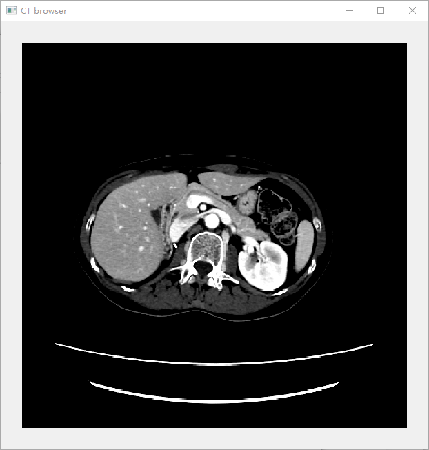

# CT Browser

为查看DeepLesion数据集准备的工具。

> The images are stored in unsigned 16 bit. One should subtract 32768 from the pixel intensity to obtain the original Hounsfield unit (HU) values.

DeepLesion数据集中的数据以unsigned 16 bit格式存储，需要从像素中减去32768。

### 功能：

- 鼠标左键点击移动图片
- 鼠标右键点击还原图片
- 鼠标滚动滑轮缩放图片
- 将要查看的文件拖放到窗口中即显示图片效果

### 运行环境：

- python 3.x
- PyQt5

```python
pip install PyQt5
```

### 运行方式：

```python
python ct_browser.py
```

### Demo

数据集原图为：


程序效果图为：


