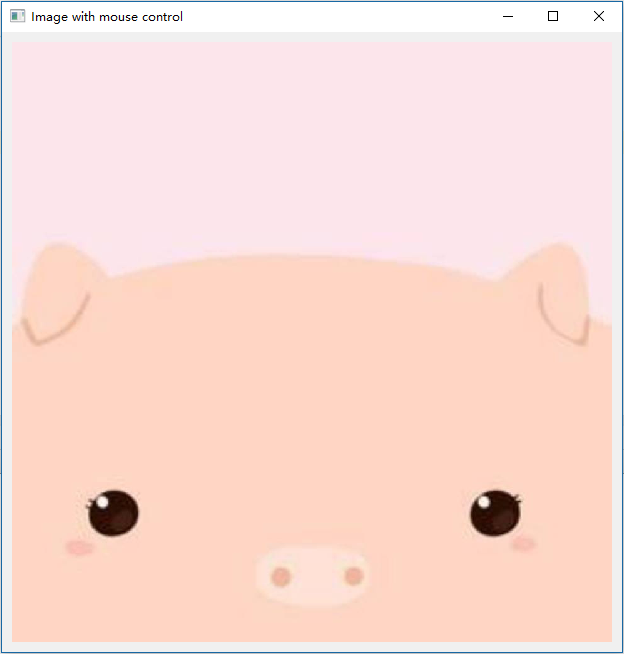
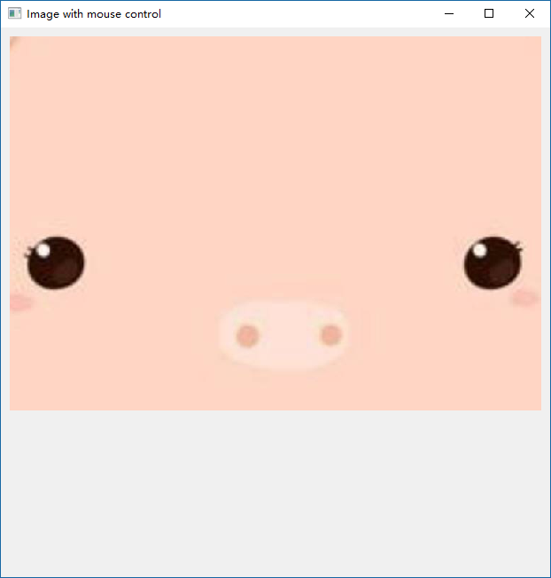

# Image with Mouse Control

鼠标控制图片

### 功能：

- 鼠标左键点击移动图片
- 鼠标右键点击还原图片
- 鼠标滚动滑轮缩放图片
- 窗口大小改变且有父级时还原图片，否则保持不变

### 运行环境：

- python 2.x or 3.x
- PyQt5

```python
pip install PyQt5
```

### 运行方式：

```python
python image_with_mouse_control.py
```

### Demo




